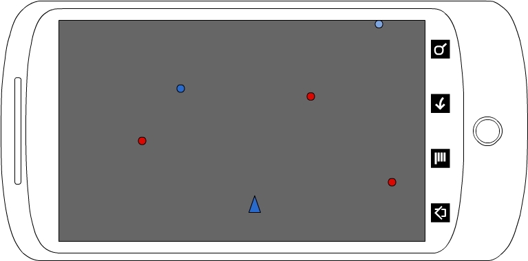
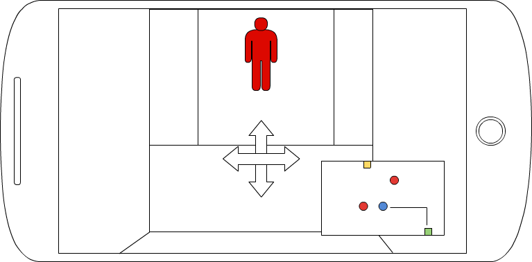

#DarkMaze

##内容
一人称視点で、暗い迷路内の探索をする。迷路内には複数の敵が存在しており、敵に触れてしまうと基本的にはゲームオーバー。ゴールはマップに表示されている。

##特徴・面白み
<dl>
	<dt>旧DarkMaze</dt>
	<dd>
	
	</dd>
	<dt>新DarkMaze</dt>
	<dd>
	
	</dd>
	<dt><h3>特徴</h3></dt>
	<dd>
		<dl>
			<dt>迷路</dt>
			<dd>マップを移動することによって移動した軌跡は残せる。</dd>
			<dt>敵</dt>
			<dd>基本的には触れてしまうとゲームオーバー。</dd>
			<dt>アイテム</dt>
			<dd>このゲームには、アイテムも実装されている。
				<dl>
				<dt>回避アイテム</dt>
					<dd>使った状態で敵に触れると回避できる。</dd>
					<dt>追跡アイテム</dt>
					<dd>敵が見えている時に使うことで、一定確率で追跡ができるようになり、マップにその敵の位置が表示されるようになる。</dd>
				</dl>
			</dd>
			<dt>ストーリー</dt>
			<dd></dd>
		</dl>
	</dd>
	<dt><h3>面白み</h3></dt>
	<dd>
		<dl>
			<dt>暗闇で見えない迷路</dt>
			<dd>迷路は基本的に暗闇、探索することによってマップに歩いた軌跡を残すことができる。</dd>
			<dt>リアルタイムで接近してくる敵の臨場感</dt>
			<dd>敵は迷路内を自由に動いている。敵が迫ってくるという緊迫感を味わえる。</dd>
		</dl>
	</dd>
</dl>

##目的・完成形
一人称への昇華、リアルタイム性での臨場感をだす。

##検証
8月の上旬までゲームエンジン使っての3Dマッピングをしてみる。できない場合は、背景イラストでの2Dでの表示にする。
<dl>
	<dt>7月</dt>
	<dd>ゲームエンジンを使っての3Dでの検証。</dd>
	<dt>8月</dt>
	<dd>上旬まで検証。prototype作成</dd>
	<dt>9月</dt>
	<dd>ゲーム開発、ゲーム素材作成。</dd>
	<dt>10月</dt>
	<dd></dd>
	<dt>11月</dt>
	<dd>プレゼン作成。</dd>
</dl>