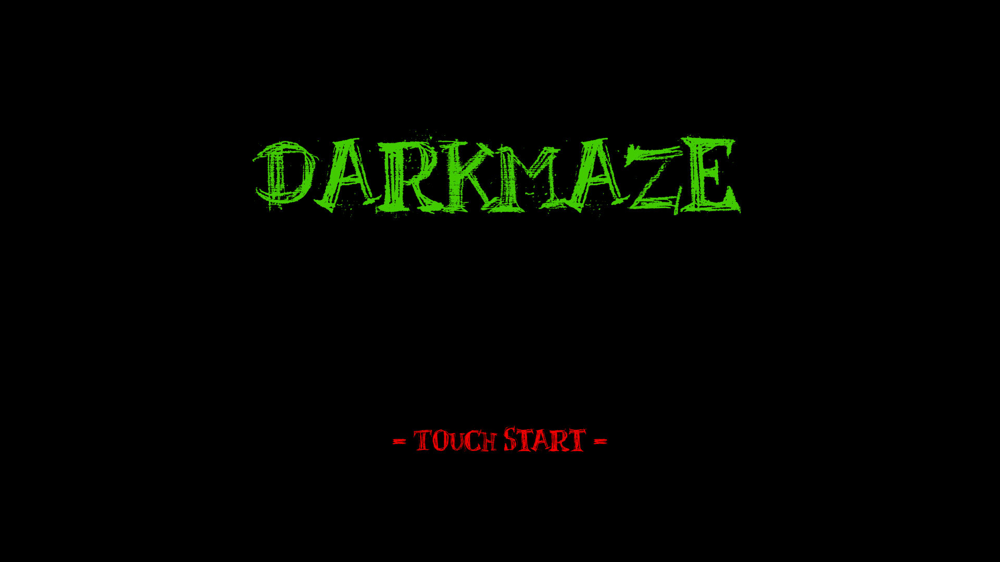
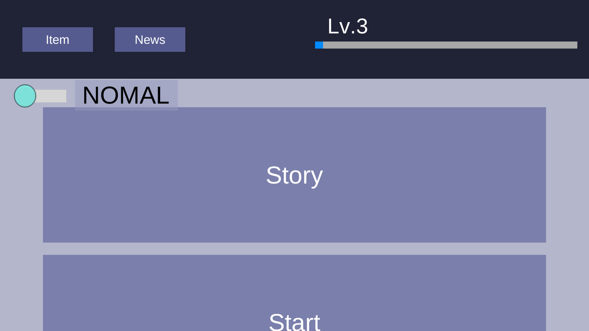
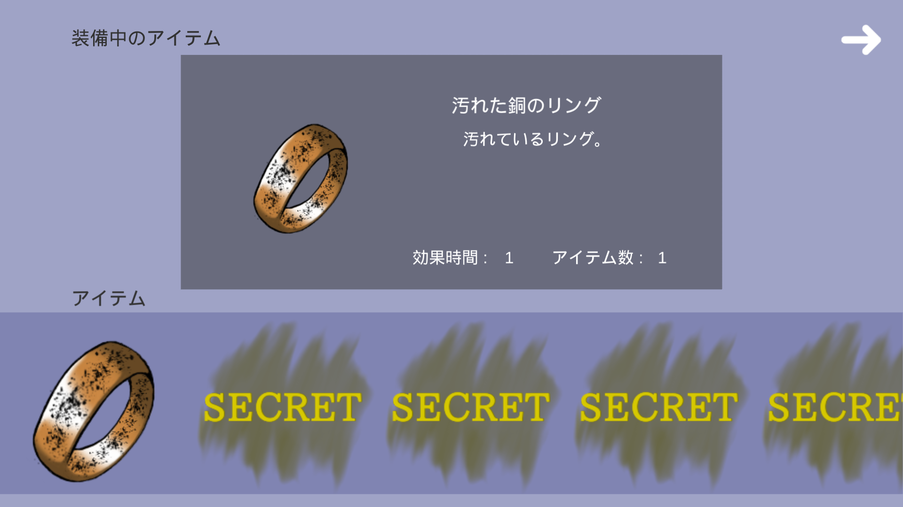
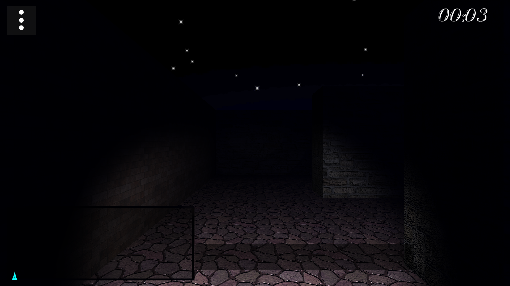
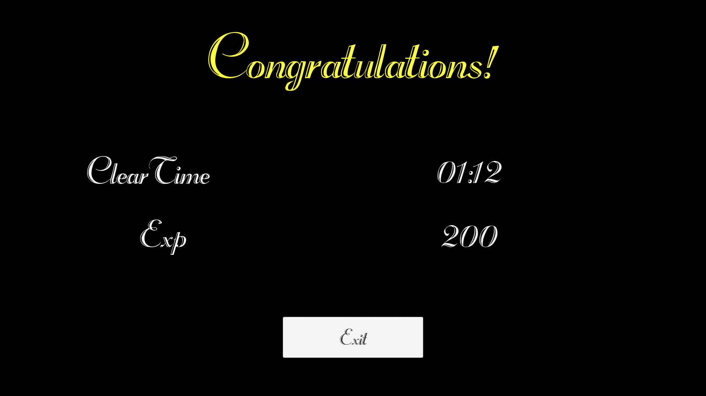
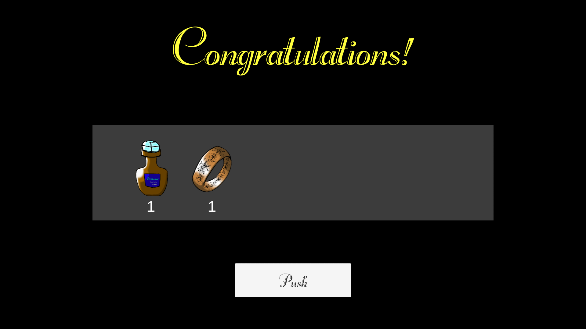

# 要件定義書

参考資料 :[ 要件定義書完全マニュアル](http://www.atmarkit.co.jp/ait/articles/0911/19/news109.html)

<dl>
	<dt><h2>1.システム導入の目的と目標</h2></dt>
	<dd>
		<dl>
			<dt>1.1システム導入の目的・目標の一覧</dt>
			<dt>1.2 課題研究からのアップグレード</dt>
			<dd>
				<dl>
					<dt>1.2.1 3Dでの表現</dt>
					<dd>課題研究では、2Dでゲームとしての機能だけしかありませんでしたが、今回はグラフィックを重視して開発していきます。</dd>
					<dt>1.2.2 迷路の自動生成</dt>
					<dd>迷路の自動生成については2年生でやったものを移植して実装していきます。</dd>
					<dt>1.2.3 一人称視点での表現</dt>
					<dd>3Dでの実装ということで、プレイヤーの視点での操作が出来るようにします。</dd>
					<dt>1.2.4 敵の実装</dt>
					<dd>より臨場感を味わっていただくため敵の実装をします。</dd>
				</dl>
			</dd>
		</dl>
	</dd>
	<dt><h2>2.概要</h2></dt>
	<dd>
		<dl>
			<dt>2.1 開発概要</dt>
			<dd>
				<dl>
					<dt>2.1.1 必要な機能をテスト</dt>
					<dd>
						まず、必要になる機能ごとにテストをしていきます。
					</dd>
					<dt>2.1.2 プロトタイプ作成</dt>
					<dd>
						機能テストの後に、製品のプロトタイプ作成に着手します。
					</dd>
					<dt>2.1.3 製品開発に着手</dt>
					<dd>製品開発に入っていきます。</dd>
				</dl>
			</dd>
			<dt>2.2 実装環境</dt>
			<dd>Android 4.0 以降</dd>
			<dt>2.3 リリース時期</dt>
			<dd>2017年1月27日予定</dd>
		</dl>
	</dd>
	
	<dt><h2>4.機能要求</h2></dt>
	<dd>
		<dl>
			<dt>4.1 現実にはない迷路、恐怖から逃げなければならないという臨場感を重視</dt>
			<dd>
				このゲームでは、ユーザーに臨場感・恐怖感をより味わっていただくことを重視しています。
			</dd>
			<dt>4.2 Android</dt>
			<dd>Androidでの実装が必要になります。</dd>
			<dt>4.3 3D</dt>
			<dd>より臨場感を出すため、3Dでの実装が必要になります。</dd>
			<dt>4.4 ランク</dt>
			<dd>ランクに伴って、アイテムの開放を行ってまいります。</dd>
			<dt>4.5 敵</dt>
			<dd>恐怖感をユーザーに与えるため敵の実装をします。</dd>
			<dt>4.6 アイテム</dt>
			<dd>敵だけでは難易度が高くなってしまうので、アイテムでプレイヤーのサポートをします。</dd>
		</dl>
	</dd>
	<dt><h2>5.入力要求と出力要求</h2></dt>
	<dd>
		<dl>
			<dt>5.1 入力要求</dt>
			<dd>
				<dl>
					<dt>5.1.1 タイトル画面での入力要求</dt>
					<dd>
						<dl>
							<dt>初回起動時</dt>
							<dd>ユーザー名の入力</dd>
							<dt>2回目以降起動時</dt>
							<dd>Start ボタンをタップ</dd>
							<dt>タイトル画面</dt>
							<dd></dd>
						</dl>
					</dd>
					<dt>5.1.2 セレクト画面での入力要求</dt>
					<dd>
						<dl>
							<dt>迷路選択</dt>
							<dd></dd>
							<dt>アイテム</dt>
							<dd></dd>
							<dt></dt>
							<dd></dd>
							<dt>セレクト画面</dt>
							<dd></dd>
						</dl>
					</dd>
					<dt>5.1.3 アイテム画面での入力要求</dt>
					<dd>
						<dl>
							<dt>アイテムの選択</dt>
							<dd></dd>
							<dd></dd>
						</dl>
					</dd>
					<dt>5.1.4 迷路画面での入力要求</dt>
					<dd>
						<dl>
							<dt>プレイヤーの移動</dt>
							<dd></dd>
							<dd></dd>
						</dl>
					</dd>
					<dt>5.1.5 リザルト画面での入力要求</dt>
					<dd>
						<dl>
							<dt>OKのタップ</dt>
							<dd></dd>
							<dt>Exitのタップ</dt>
							<dd></dd>
							<dd></dd>
							<dd></dd>
						</dl>
					</dd>
				</dl>
			</dd>
		</dl>
	</dd>
	<dt><h2>6.インターフェイス</h2></dt>
	<dd>
		<dl>
			<dt>1.タイトル画面</dt>
			<dd></dd>
			<dt>2.セレクト画面</dt>
			<dd></dd>
			<dt>3.アイテム画面</dt>
			<dd></dd>
			<dt>4.迷路画面</dt>
			<dd></dd>
			<dt>5.リザルト画面</dt>
			<dd></dd>
		</dl>
	</dd>
</dl>

