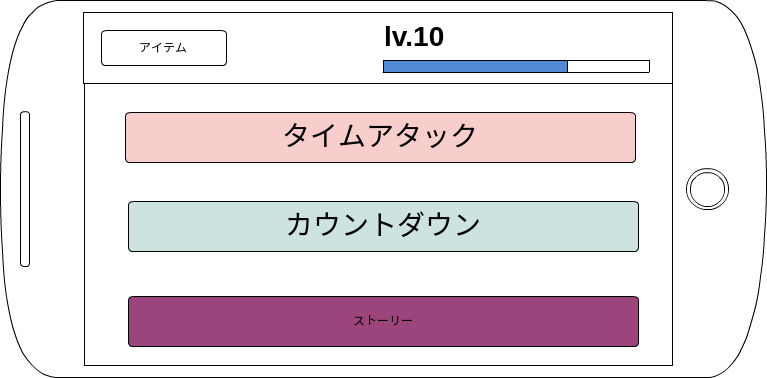

##画面レイアウト

<dl>
<dt>ダンジョンセレクト画面</dt>
<dd>

</dd>
<dt>レベル制</dt>
<dl>プレイヤーにはレベルがあり、それに応じて挑めるダンジョンが増えていく。 タイムアタックはlv.20から...等</dl>

<dt>ダンジョンの種類</dt>
<dd>
	<dl>
		<dt>ストーリー</dt>
		<dl>軽いストーリ展開があります</dl>
		<dt>カウントダウン</dt>
		<dl>指定されたタイム以内にゴールすることが条件になります。このモードではダンジョンのどこかに落ちているアイテム（鍵）を手に入れなければゴールできない仕様になっています。</dl>
		<dt>タイムアタック</dt>
		<dl>タイムアタックはクリアタイムを測り、クリアタイムが早ければ早いほど多くの経験値を獲得することができます。</dl>
	</dl>
</dd>
</dl>