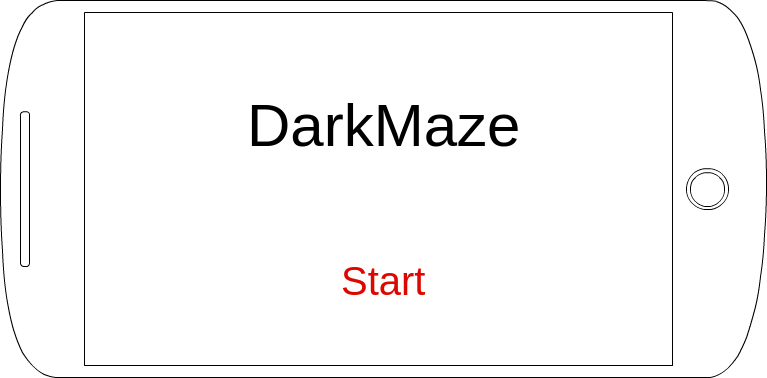
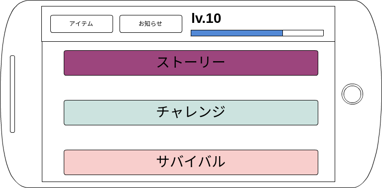
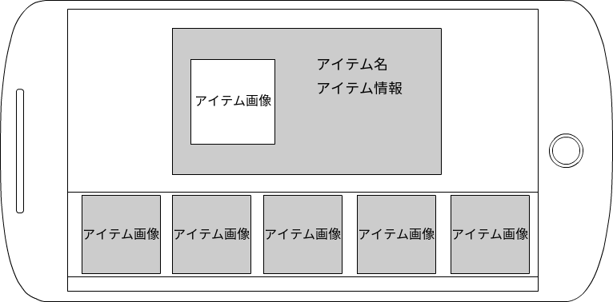
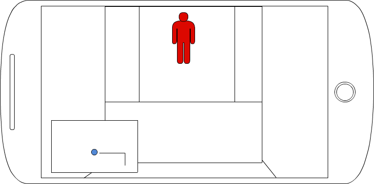
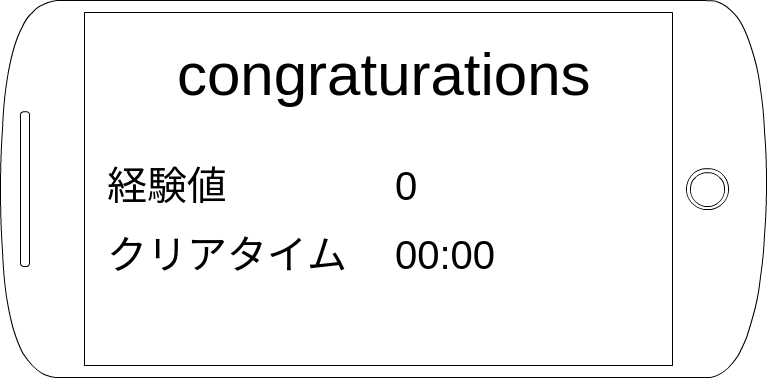
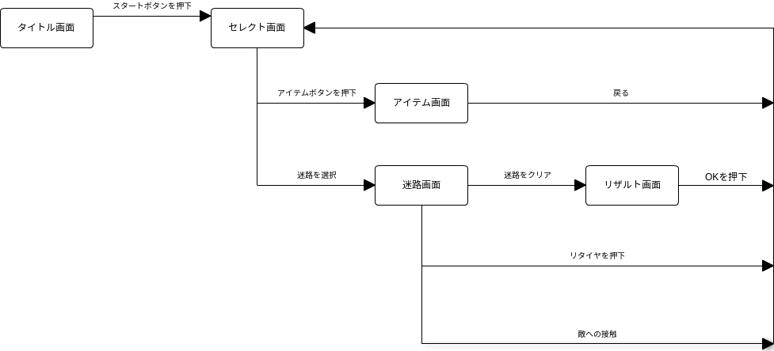

##画面レイアウト・説明

<dl>

<dt>タイトル画面</dt>
<dd>
	
</dd>

<dt>セレクト画面</dt>
<dd>
	
	<dl>
	<dt>アイテム</dt>
	<dl>アイテム選択画面に遷移します。</dl>
	<dt>お知らせ</dt>
	<dl>ゲームの情報を表示します。</dl>
	<dt>レベル制</dt>
	<dl>プレイヤーにはレベルがあり、それに応じて取得できるアイテムが増えます。</dl>
	<dt>ダンジョンの種類</dt>
	<dd>
		<dl>
			<dt>ストーリー</dt>
			<dl>軽いストーリー展開があります</dl>
			<dt>チャレンジ</dt>
			<dl>指定されたタイム以内にゴールすることが条件になります。このモードではダンジョンのどこかに落ちているアイテム（鍵）を手に入れなければゴールできない仕様になっています。</dl>
			<dt>サバイバル</dt>
			<dl>どれだけの間生き残っていられるか。このモードではアイテムの使用はできません。</dl>
		</dl>
		</dd>
</dd>
</dd>

<dt>アイテム画面</dt>
<dd>
	
	<dl>
		<dt>アイテム</dt>
		<dd>ここでは迷路で取得したアイテムを選択して、装備することができます。アイテム情報を見ることができ、アイテムによって効果は変わります。</dd>
	</dl>
</dd>

<dt>迷路画面</dt>
<dd>
	
	<dl>
		<dt>敵</dt>
		<dd>迷路内では、敵がプレイヤーを迫ってきます。ゲームオーバーに触れてしまうとになり迷路選択画面に戻ります。</dd>
		<dt>アイテム</dt>
		<dd>迷路上にランダムで落ちています。</dd>
		<dt>ミニマップ</dt>
		<dd>画面左下にあり、プレイヤーの位置が表示され移動することで軌跡をのこすことができます。</dd>
		<dt>ゴール</dt>
		<dd>ゴールの位置は視界から確認できるようになっており、光の柱が見えるようになっています。</dd>
	</dl>
</dd>

<dt>リザルト画面</dt>
<dd>
	
	<dl>
		<dt>クリアタイム</dt>
		<dd>迷路をクリアしたタイムを表示します。</dd>
		<dt>経験値</dt>
		<dd>プレイヤーレベルの経験値を獲得することができます。</dd>
		<dt>アイテム</dt>
		<dd>取得したアイテムを表示します。</dd>
	</dl>
</dd>

<dt>画面遷移図</dt>
<dd>
	
</dd>
</dl>