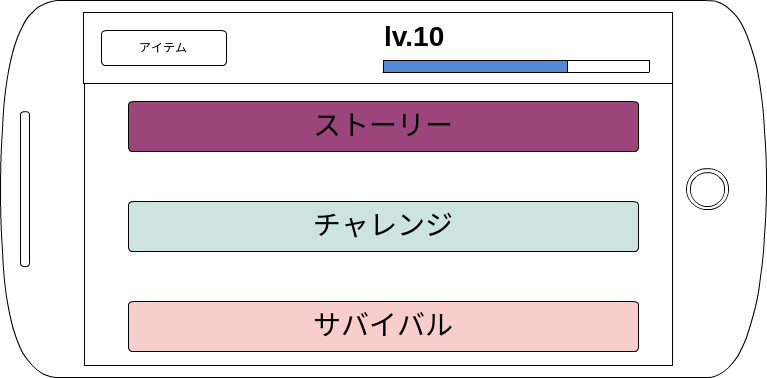

##画面レイアウト

<dl>
<dt>ダンジョンセレクト画面</dt>
<dd>

</dd>
<dt>レベル制</dt>
<dl>プレイヤーにはレベルがあり、それに応じて挑めるダンジョンが増えていく。</dl>

<dt>ダンジョンの種類</dt>
<dd>
	<dl>
		<dt>ストーリー</dt>
		<dl>軽いストーリ展開があります</dl>
		<dt>チャレンジ</dt>
		<dl>指定されたタイム以内にゴールすることが条件になります。このモードではダンジョンのどこかに落ちているアイテム（鍵）を手に入れなければゴールできない仕様になっています。</dl>
		<dt>サバイバル</dt>
		<dl>どれだけの間生き残っていられるか。このモードではアイテムの使用はできません。</dl>
	</dl>
</dd>
</dl>